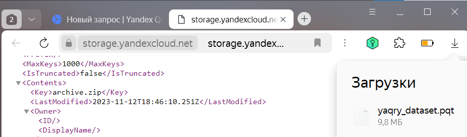
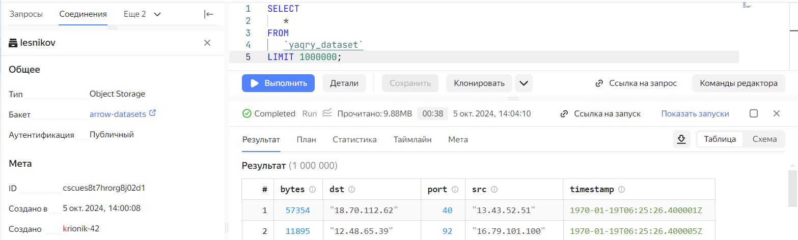
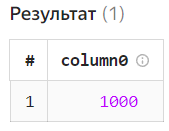
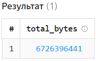
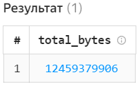

# Использование Yandex Query для анализа данных сетевой активности


## Цель

1.  Изучить возможности технологии `Yandex Query` для анализа
    структурированных наборов данных
2.  Получить навыки построения аналитического пайплайна для анализа
    данных с помощью сервисов `Yandex Cloud`
3.  Закрепить практические навыки использования `SQL` для анализа данных
    сетевой активности в сегментированной корпоративной сети

## ️Исходные данные

1.  R 4.4.1
2.  RStudio 2024.04.2+764
3.  Yandex Cloud

## ️Общий план выполнения

Используя сервис [Yandex
Query](https://yandex.cloud/ru/docs/query/concepts/) настроить доступ к
данным, хранящимся в сервисе хранения данных `Yandex Object Storage`.
При помощи соответствующих SQL запросов ответить на вопросы.

## Содержание ЛР

### Шаг 1: Проверить доступность данных в Yandex Object Storage

Файл `yaqry_dataset.pqt` бакета `arrow-datasets` доступен по адресу
[yaqry_dataset.pqt](https://storage.yandexcloud.net/arrow-datasets/yaqry_dataset.pqt)

<figure>

<figcaption aria-hidden="true">Image description</figcaption>
</figure>

### Шаг 2: Подключить бакет как источник данных для Yandex Query

1.  **Создать соединение для бакета в S3 хранилище**

    <figure>
    
    <figcaption aria-hidden="true">Image description</figcaption>
    </figure>

### Шаг 3: Задания

1.  **Известно, что IP адреса внутренней сети начинаются с октетов,
    принадлежащих интервалу ‘12-14’. Определите количество хостов
    внутренней сети, представленных в датасете.**

        SELECT COUNT(*) FROM (
            SELECT DISTINCT ip FROM (
                SELECT dst AS ip FROM yaqry_dataset
                WHERE dst LIKE '12.%' OR dst LIKE '13.%' OR dst LIKE '14.%'

                UNION

                SELECT src AS ip FROM yaqry_dataset
                WHERE src LIKE '12.%' OR src LIKE '13.%' OR src LIKE '14.%'
            )
        )

    ``` r
    1000
    ```

        [1] 1000

    <figure>
    
    <figcaption aria-hidden="true">Image description</figcaption>
    </figure>

2.  **Определите суммарный объем исходящего трафика**

        SELECT SUM(bytes) AS total_bytes FROM yaqry_dataset
        WHERE (src LIKE '12.%' OR src LIKE '13.%' OR src LIKE '14.%')
              and (dst NOT LIKE '12.%' AND dst NOT LIKE '13.%' AND dst NOT LIKE '14.%')

    ``` r
    6726396441
    ```

        [1] 6726396441

    <figure>
    
    <figcaption aria-hidden="true">Image description</figcaption>
    </figure>

3.  **Определите суммарный объем входящего трафика**

        SELECT SUM(bytes) AS total_bytes FROM yaqry_dataset
        WHERE (dst LIKE '12.%' OR dst LIKE '13.%' OR dst LIKE '14.%')
              and (src NOT LIKE '12.%' AND src NOT LIKE '13.%' AND src NOT LIKE '14.%')

    ``` r
    12459379906
    ```

        [1] 12459379906

    <figure>
    
    <figcaption aria-hidden="true">Image description</figcaption>
    </figure>

## ️Оценка результата

Был проведён анализ сегментированной корпоративной сети с помощью языка
`SQL`

## ️Вывод

В результате выполнения работы были:

-   изучены возможности технологии `Yandex Query` для анализа
    структурированных наборов данных
-   закреплены практические навыки использования `SQL` для анализа
    данных сетевой активности в сегментированной корпоративной сети
