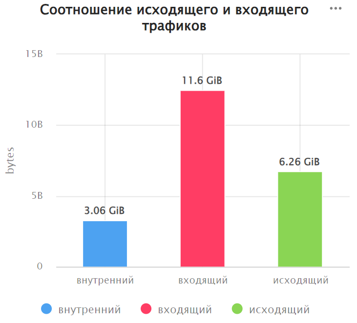

# Использование Yandex DataLens для анализа данных сетевой активности

## Цель

1.  Изучить возможности технологии `Yandex DataLens` для визуального
    анализа структурированных наборов данных
2.  Получить навыки визуализации данных для последующего анализа с
    помощью сервисов `Yandex Cloud`
3.  Получить навыки создания решений `мониторинга/SIEM` на базе облачных
    продуктов и открытых программных решений
4.  Закрепить практические навыки использования `SQL` для анализа данных
    сетевой активности в сегментированной корпоративной сети

## ️Исходные данные

1.  R 4.4.1
2.  RStudio 2024.04.2+764
3.  Yandex Cloud
4.  [Dashboard](https://datalens.yandex/wanurbl92pjij)

## ️Общий план выполнения

Используя сервис [Yandex DataLens](https://datalens.yandex.cloud/)
настроить доступ к Yandex Query, который Вы использовали ранее
выполненных практических работ, и визуально представить результаты
анализа данных

## Содержание ЛР

### Шаг 1: Настроить подключение к Yandex Query из DataLens

1.  **Перейти в соответствующий сервис – [Yandex
    DataLens](https://datalens.yandex.ru/)**
2.  **Выбрать “Подключения” – “Создать новое подключение”**
3.  **Выбрать в разделе “Файлы и сервисы” Yandex Query**
4.  **Настроить и проверить подключение**

### Шаг 2: Создать из запроса YandexQuery датасет DataLens

### Шаг 3: Делаем нужные графики и диаграммы

1.  **Представить в виде круговой диаграммы соотношение внешнего и
    внутреннего сетевого трафика.**

Внешний трафик не представлен на диаграмме, поскольку сборщик сетевой
активности расположен в сегментированной корпоративной сети и не имеет
доступа к пакетам, у которых `src` и `dst` - внешние IP-адреса. Смежный
трафик - трафик, у пакетов которого `src` и `dst` одновременно не
принадлежат сегментированной корпоративной сети.

1.  **Представить в виде столбчатой диаграммы соотношение входящего и
    исходящего трафика из внутреннего сетвого сегмента.**

Помимо входящего (`src` - внешний, `dst` - внутренний) и исходящего
(`src` - внутренний, `dst` - внешний) трафика, следует отобразить и
внутренний (`src` - внутренний, `dst` - внутренний) трафик (не
пренадлежащий к этим группам)

1.  **Построить график активности (линейная диаграмма) объема трафика во
    времени.**

### Шаг 4: Составляем дашборд

Помимо основных чартов, для общей информативности разубно добавить и
другие элементы. Например:

-   индикаторы
-   поля параметров
-   рейтинги и т.д.

Итоговый dashboard доступен по ссылке вверху документа.

## ️Оценка результата

Был проведён анализ сегментированной корпоративной сети с помощью языка
`SQL`

## ️Вывод

В результате выполнения работы были:

-   изучены возможности технологии `Yandex DataLens` для визуального
    анализа структурированных наборов данных
-   получены навыки визуализации данных для последующего анализа с
    помощью сервисов `Yandex Cloud`, а также создания решений
    `мониторинга/SIEM` на базе облачных продуктов и открытых программных
    решений
-   закреплены практические навыки использования `SQL` для анализа
    данных сетевой активности в сегментированной корпоративной сети

PS. использование R `{R}`
